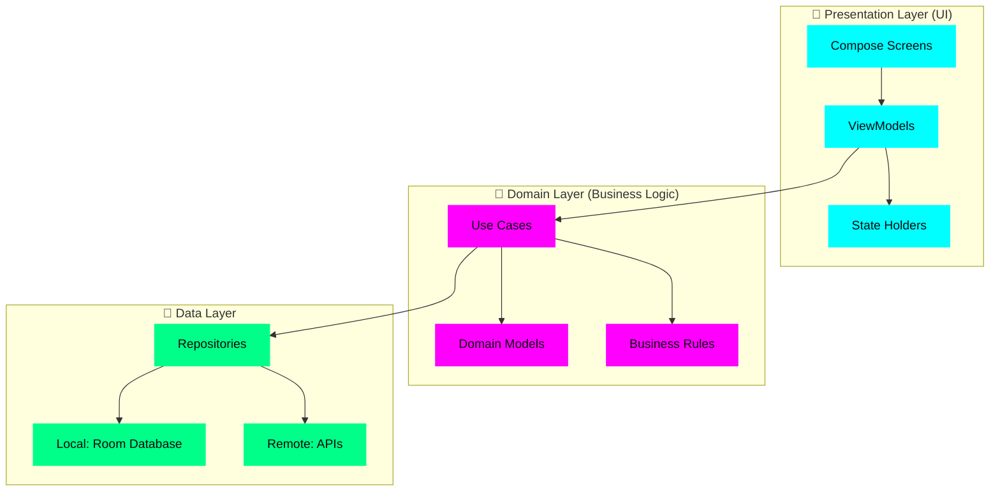
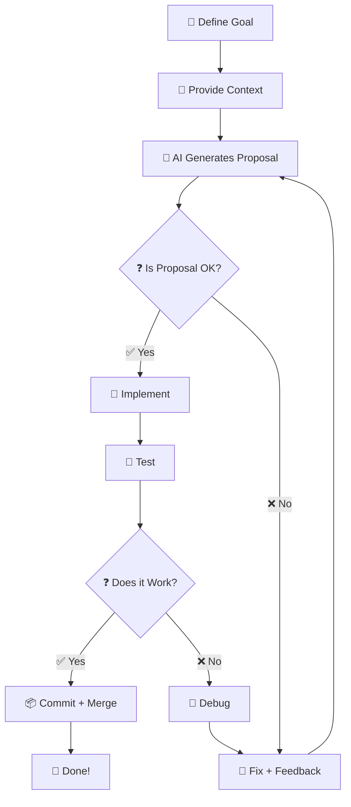

# 🚴‍♂️ **OptiBike**

> **Professional Android application for interactive bike fitting** – **comprehensive tool** for optimizing gravel and road bike position.
> **Optimize your gravel/road bike position** in 7 steps with manual measurements, AR scanning, and PDF export.

---

## 📌 **Table of Contents**
- [📌 About OptiBike](#-about-optibike)
- [🎯 Features](#-features)
- [📱 System Requirements](#-system-requirements)
- [🛠️ Technologies](#-technologies)
- [🚀 Getting Started](#-getting-started)
- [📂 Project Structure](#-project-structure)
- [🏗️ Architecture](#-architecture)
- [📊 Reference Data](#-reference-data)
- [🧪 Testing](#-testing)
- [📦 Building and Deployment](#-building-and-deployment)
- [🤖 Collaboration with AI Agent (Vibe Coding)](#-collaboration-with-ai-agent-vibe-coding)
- [📜 Documentation](#-documentation)
- [🙏 Contribution and License](#-contribution-and-license)
- [📞 Contact](#-contact)

---

## 📌 **About OptiBike**

### **🎯 Purpose**
OptiBike is a **professional mobile application** (Android) designed to help cyclists **optimize their bike position** for gravel and road bikes. 

Its main goal is to **improve comfort, performance, and ergonomics** during cycling through **precise position adjustment** based on a **7-step bike fitting process** derived from **industry-standard practices**. 

### **💡 Why OptiBike?**
- **📚 Education:** Learn **proper bike fitting techniques** step by step through interactive guidance.
- **🎯 Practicality:** Support for **manual measurements** and **automatic AR scanning** for precise results.
- **📄 Documentation:** Generate **detailed PDF reports** with measurements, results, and expert recommendations.
- **🌐 Offline-First:** **100% functionality without internet** – perfect for cyclists in remote areas or bikepacking.

### **📖 Knowledge Foundation**
OptiBike is based on **industry-standard bike fitting practices** for gravel and road bikes, including:
- **7 structured bike fitting steps** (saddle height, tilt, fore-aft position, saddle-handlebar distance, handlebar height, cockpit adjustment, cleat positioning).
- **Reference tables** (height → saddle height, height differences, reach, etc.).
- **Expert tips** from the cycling industry (generic, non-copyrighted).

**Note:** All references to specific proprietary systems (Ergon, Dr. Kim Tofaute, Fitting Box) have been **removed** to avoid copyright issues. Only **generic industry standards** are used.

---

## 🎯 **Features**

### **✅ MVP (Version 1.0.0) – Core Functionality**

| **Module** | **Description** | **Status** |
|-----------|----------------|------------|
| **Step-by-Step Guide** | Interactive 7-step bike fitting guide with detailed instructions, illustrations, and expert tips. | ✅ Implemented |
| **Manual Measurements** | Form-based data entry for height, leg length, shoulder width, bike type, etc. with real-time validation. | ✅ Implemented |
| **Parameter Calculator** | Calculates optimal bike fitting values (saddle height, handlebar height, distances) based on industry reference tables. | ✅ Implemented |
| **Results & Visualization** | Summary screen with all calculated parameters + bike diagram visualization (SVG/Canvas). | ✅ Implemented |
| **PDF Export** | Generate comprehensive PDF reports with input data, results, diagrams, and recommendations. | ✅ Implemented |
| **Measurement History** | Local storage of previous fitting sessions with filtering and export capabilities. | ✅ Implemented |
| **Settings** | Language (PL/EN), dark mode, units (metric/imperial), sounds, measurement precision. | ✅ Implemented |
| **AR Measurements** | Optional bike/body scanning using ARCore and CameraX for automatic measurements. | ⚠️ Post-MVP |

### **🔜 Post-MVP (Planned Enhancements)**

| **Module** | **Description** | **Priority** | **Estimated Time** |
|-----------|----------------|--------------|-------------------|
| **Strava Integration** | Import biometric data (height, weight, age) and export fitting reports as activity notes. | 🥇 High | 2-3 weeks |
| **Garmin Integration** | Sync with Garmin devices (cadence, power, heart rate) and import bike profiles. | 🥈 Medium-High | 4-5 weeks |
| **Cloud Sync** | Backup measurement history to Firebase/Google Drive for cross-device synchronization. | 🥉 Medium | 1 week |
| **Result Sharing** | Share PDF reports with mechanics, coaches, or other users. | 🥉 Medium | 1 week |
| **Multi-Bike Profiles** | Save and manage fitting configurations for multiple bikes. | 🟠 Low | 5 days |
| **Advanced AR Features** | 3D bike model visualization with real-time adjustment preview. | 🟠 Low | 2 weeks |
| **Community Features** | Share and compare fitting results with other users (anonymous). | 🟠 Low | 2 weeks |

**Detailed Roadmap:** See [`docs/bike-fitting-app-post-mvp-roadmap-strava-garmin-integrations.md`](docs/bike-fitting-app-post-mvp-roadmap-strava-garmin-integrations.md)

---

## 📱 **System Requirements**

### **Minimum Requirements**
| **Parameter** | **Requirement** | **Notes** |
|--------------|----------------|-----------|
| **Operating System** | Android 17 (API 34) and above | Required for ARCore support (optional feature). |
| **RAM** | 2 GB+ | 4 GB recommended for optimal performance. |
| **Storage Space** | 100 MB+ | APK + local database storage. |
| **ARCore Support** | Optional | Required only for AR measurement feature. |
| **Camera** | Yes | Required for AR measurements. |
| **Google Play Services** | Required | For ARCore and optional integrations. |

### **Recommended Devices for Testing**
| **Device** | **Android Version** | **ARCore Support** | **Purpose** |
|------------|---------------------|---------------------|-------------|
| Google Pixel 10 Pro | Android 17 | ✅ Yes | Primary testing (AR + performance) |
| Samsung Galaxy S25 | Android 17 | ✅ Yes | Compatibility testing |


---

## 🛠️ **Technologies**

### **Core Stack**
| **Category** | **Technology** | **Version** | **Purpose** |
|--------------|----------------|------------|---------|
| **Language** | Kotlin | 1.9.0 | Primary application language (100% coverage). |
| **UI Framework** | Jetpack Compose | 1.5.0 | Modern declarative UI framework (Material 3). |
| **Architecture** | MVVM + Clean Architecture | - | Separation of concerns: Presentation, Domain, Data layers. |
| **Dependency Injection** | Hilt | 2.48 | Compile-time dependency injection. |
| **Database** | Room | 2.6.0 | Local SQLite database for measurement history. |
| **AR Framework** | ARCore | 1.40.0 | Augmented Reality for bike/body scanning (optional). |
| **Camera** | CameraX | 1.3.0 | Device camera handling with lifecycle awareness. |
| **PDF Generation** | iTextPDF | 7.2.5 | Create PDF reports with tables and diagrams. |
| **Navigation** | Compose Navigation | 2.7.5 | Type-safe navigation between screens. |

### **Testing Stack**
| **Category** | **Technology** | **Purpose** |
|--------------|----------------|-------------|
| **Unit Tests** | JUnit 5 + Mockito | Unit testing with >80% coverage. |
| **UI Tests** | Espresso + Compose Testing | UI testing for critical user flows. |
| **Manual Tests** | Physical Devices | Real-world testing on Pixel/Samsung. |

### **Build & CI/CD**
| **Tool** | **Purpose** |
|----------|-------------|
| **Gradle (KTS)** | Build system with Kotlin DSL. |
| **Git + GitHub** | Version control and collaboration. |
| **GitHub Actions** | CI/CD pipeline for automatic APK building. |

**Detailed Setup:** See [`docs/bike-fitting-app-tools-environment-and-vibe-coding-conventions.md`](docs/bike-fitting-app-tools-environment-and-vibe-coding-conventions.md)

---

## 🚀 **Getting Started**

### **📥 Prerequisites**

#### **1. Development Environment**
- **Android Studio:** Giraffe (2022.3.1) or later
- **JDK:** 17 (required for Android Gradle Plugin 8.0+)
- **Android SDK:** API 34 (Android 17)
- **Gradle:** 8.0+
- **Git:** 2.30+

#### **2. Optional (for AR Testing)**
- **ARCore:** Install via Android Studio (Tools → SDK Manager → Google Play services)
- **ARCore-Supported Device:** Pixel 7 Pro, Samsung Galaxy S23, etc.

---

### **💻 Installation & Setup**

#### **1. Clone the Repository**
```bash
# Clone the main repository
git clone https://github.com/0x-void/optibike.git

# Navigate to project directory
cd optibike
```

#### **2. Open in Android Studio**
1. Launch **Android Studio Giraffe (2022.3.1+)**
2. Select **File → Open** and choose the `bike-fitting-app` directory
3. Wait for **Gradle sync** to complete (1-2 minutes)
4. Ensure all dependencies are downloaded

#### **3. Configure Project**
- Verify **JDK 17** is selected in **File → Project Structure → SDK Location**
- Install **Android SDK 34** if not already present
- For AR testing: Install **Google Play Services** via SDK Manager

---

### **🏃 Quick Start (First Run)**

```bash
# Build debug APK
./gradlew assembleDebug

# Install on connected device
adb install app/build/outputs/apk/debug/app-debug.apk

# Run the app
adb shell am start -n com.void.optibike/.MainActivity
```

---

## 📂 **Project Structure**

```
optibike/
├── app/                                  # Main application module
│   ├── assets/                          # Static assets (logos, etc.)
│   │   ├── optibike_logo_1.svg          # Logo Concept 1: "O" + Bike (minimalist)
│   │   ├── optibike_logo_2.svg          # Logo Concept 2: OptiBike Wordmark
│   │   └── optibike_logo_3.svg          # Logo Concept 3: Hexagonal
│   └── src/
│       └── main/
│           ├── java/com/optibike/fitting/ # Kotlin source code
│           │   ├── di/                  # Hilt Dependency Injection Modules
│           │   │   ├── AppModule.kt
│           │   │   └── RepositoryModule.kt
│           │   ├── data/               # Data Layer (Clean Architecture)
│           │   │   ├── local/           # Room Database
│           │   │   │   ├── dao/         # Data Access Objects
│           │   │   │   │   └── MeasurementDao.kt
│           │   │   │   ├── entities/     # Room Entities
│           │   │   │   │   └── MeasurementEntity.kt
│           │   │   │   └── BikeFittingDatabase.kt
│           │   │   └── repository/     # Repositories (interface + impl)
│           │   │       └── MeasurementRepository.kt
│           │   ├── domain/             # Domain Layer (Business Logic)
│           │   │   ├── model/          # Business Data Models
│           │   │   │   └── Measurement.kt
│           │   │   ├── usecase/        # Use Cases (Business Rules)
│           │   │   │   ├── CalculateSaddleHeight.kt
│           │   │   │   ├── CalculateHandlebarHeight.kt
│           │   │   │   ├── CalculateSaddleTilt.kt
│           │   │   │   ├── CalculateSaddleForeAft.kt
│           │   │   │   ├── CalculateHandlebarDistance.kt
│           │   │   │   └── CalculateCleatPosition.kt
│           │   │   └── utils/          # Helpers & Constants
│           │   │       ├── BikeFittingFormulas.kt
│           │   │       ├── Constants.kt
│           │   │       └── Validators.kt
│           │   └── presentation/      # Presentation Layer (UI)
│           │       ├── viewmodel/     # ViewModels (MVVM)
│           │       │   ├── GuideViewModel.kt
│           │       │   ├── MeasurementViewModel.kt
│           │       │   ├── CalculatorViewModel.kt
│           │       │   ├── ResultsViewModel.kt
│           │       │   └── SettingsViewModel.kt
│           │       ├── screens/        # Jetpack Compose Screens
│           │       │   ├── splash/       # Splash Screen
│           │       │   │   └── SplashScreen.kt
│           │       │   ├── welcome/      # Welcome/Onboarding
│           │       │   │   ├── WelcomeScreen.kt
│           │       │   │   └── LanguageSelectionScreen.kt
│           │       │   ├── guide/        # Step-by-Step Guide
│           │       │   │   ├── GuideScreen.kt
│           │       │   │   └── StepDetailScreen.kt
│           │       │   ├── measurement/  # Measurement Screens
│           │       │   │   ├── ManualMeasurementScreen.kt
│           │       │   │   └── ARMeasurementScreen.kt
│           │       │   ├── calculator/   # Parameter Calculator
│           │       │   │   └── CalculatorScreen.kt
│           │       │   ├── results/      # Results & Visualization
│           │       │   │   ├── ResultsScreen.kt
│           │       │   │   └── PdfExportScreen.kt
│           │       │   ├── history/      # Measurement History
│           │       │   │   └── HistoryScreen.kt
│           │       │   └── settings/     # App Settings
│           │       │       └── SettingsScreen.kt
│           │       ├── components/    # Reusable Compose Components
│           │       │   ├── BikeFittingCard.kt
│           │       │   ├── NeonButton.kt
│           │       │   ├── InputField.kt
│           │       │   ├── StepIndicator.kt
│           │       │   ├── MeasurementCard.kt
│           │       │   └── ...
│           │       ├── theme/         # Cyberpunk Theme
│           │       │   ├── Color.kt
│           │       │   ├── Theme.kt
│           │       │   └── Type.kt
│           │       └── navigation/    # Navigation
│           │           ├── NavGraph.kt
│           │           ├── AppNavHost.kt
│           │           └── Destinations.kt
│           │   └── MainActivity.kt     # App Entry Point
│           └── res/                   # Android Resources
│               ├── drawable/          # Images & Icons
│               │   ├── res-drawable-optibike_logo.xml # Android Vector Asset (app icon)
│               │   ├── ic_launcher.xml
│               │   ├── ic_guide.xml
│               │   ├── ic_calculator.xml
│               │   ├── ic_history.xml
│               │   ├── ic_settings.xml
│               │   └── ...
│               ├── values/            # Default Resources
│               │   ├── colors.xml
│               │   ├── strings.xml     # 🇬🇧 English Strings
│               │   ├── styles.xml
│               │   └── themes.xml
│               └── values-pl/         # 🇵🇱 Polish Resources
│                   └── strings.xml     # Polish Strings
│   ├── build.gradle.kts              # Module-level Gradle config
│   └── AndroidManifest.xml
├── docs/                               # 📚 Project Documentation
│   ├── bike-fitting-app-design-guidelines.md
│   ├── bike-fitting-app-functional-and-non-functional-requirements.md
│   ├── bike-fitting-app-implementation-plan-and-schedule.md
│   ├── bike-fitting-app-mockupy-ui-cyberpunk-style.html
│   ├── bike-fitting-app-post-mvp-roadmap-strava-garmin-integrations.md
│   ├── bike-fitting-app-readme-md-project-documentation.md
│   ├── bike-fitting-app-tools-environment-and-vibe-coding-conventions.md
│   ├── bike-fitting-app-user-interaction-flow-user-journey.md
│   └── bike-fitting-app-vibe-coding-methodology-and-development-process.md
├── build.gradle.kts                  # Project-level Gradle config
├── settings.gradle.kts              # Project settings
├── gradle.properties                 # Gradle properties
└── README.md                          # 📄 This Document
```

**Note:** All documentation files in `docs/` are **translated to English** and ready for use.

---

## 🏗️ **Architecture**

### **📌 Clean Architecture + MVVM**

OptiBike follows **Clean Architecture** principles with **MVVM** (Model-View-ViewModel) pattern:



#### **Layer Responsibilities:**

| **Layer** | **Responsibility** | **Components** |
|-----------|-------------------|----------------|
| **Presentation** | UI, User Interaction | Compose Screens, ViewModels, Navigation |
| **Domain** | Business Logic | Use Cases, Domain Models, Business Rules |
| **Data** | Data Management | Repositories, DAO, Database, API Clients |

### **🔌 Dependency Injection (Hilt)**

**Setup:**
```kotlin
// App.kt
@HiltAndroidApp
class OptiBikeApp : Application()

// MainActivity.kt
@AndroidEntryPoint
class MainActivity : ComponentActivity() {
    @Inject lateinit var viewModelFactory: ViewModelProvider.Factory
}
```

**Modules:**
```kotlin
// di/AppModule.kt
@Module
@InstallIn(SingletonComponent::class)
object AppModule {
    @Provides
    @Singleton
    fun provideMeasurementRepository(dao: MeasurementDao): MeasurementRepository {
        return MeasurementRepositoryImpl(dao)
    }
}
```

**Usage:**
```kotlin
// In ViewModels
@HiltViewModel
class MeasurementViewModel @Inject constructor(
    private val measurementRepository: MeasurementRepository
) : ViewModel()
```

**Detailed Architecture:** See [`docs/bike-fitting-app-tools-environment-and-vibe-coding-conventions.md`](docs/bike-fitting-app-tools-environment-and-vibe-coding-conventions.md)

---

## 📊 **Reference Data**

### **📖 Standard Bike Fitting Tables**

All reference tables are based on **industry-standard bike fitting practices** for gravel and road bikes. These are **generic tables** not tied to any proprietary system.

#### **Table 1: Saddle Height (Road vs. Gravel)**

| **Height (cm)** | **Road (mm)** | **Gravel (mm)** | **Formula** |
|-----------------|---------------|-----------------|-------------|
| 150 | 600 | 598 | `height * 0.45` |
| 160 | 660 | 657 | `height * 0.45` |
| 170 | 720 | 717 | `height * 0.45` |
| 180 | 780 | 777 | `height * 0.45` |
| 190 | 840 | 837 | `height * 0.45` |
| 200 | 900 | 897 | `height * 0.45` |

**Note:** Gravel bikes use **2-3mm lower** saddle height for better control on technical terrain.

#### **Table 2: Saddle-Handlebar Height Difference (C = A - B)**

| **Height (cm)** | **Road (mm)** | **Gravel (mm)** |
|-----------------|---------------|-----------------|
| 150 | 50 | 20 |
| 160 | 60 | 30 |
| 170 | 70 | 40 |
| 180 | 81 | 51 |
| 190 | 96 | 66 |
| 200 | 111 | 81 |

**Formula:** `C = A (handlebar height) - B (saddle height)`

#### **Table 3: Saddle Fore-Aft Position**

| **Frame Reach (mm)** | **Recommended Position (mm)** | **Gravel Adjustment** |
|----------------------|-------------------------------|-----------------------|
| 370-390 | 0 | -5mm |
| 390-410 | +5mm | 0 |
| 410-430 | +10mm | +5mm |

**Note:** Adjustments based on riding style (sporty vs. touring).

#### **Table 4: Handlebar Width**

| **Shoulder Width (cm)** | **Recommended Width (cm)** | **Aerodynamics** | **Comfort** |
|-------------------------|-----------------------------|-----------------|------------|
| 30-35 | 38-40 | -2cm | +2cm |
| 36-40 | 40-42 | -2cm | +2cm |
| 41-45 | 42-44 | -2cm | +2cm |

**Detailed Tables:** See [`docs/bike-fitting-app-functional-and-non-functional-requirements.md`](docs/bike-fitting-app-functional-and-non-functional-requirements.md) Section 2.1.3

---

## 🧪 **Testing**

### **🔹 Test Strategy**

| **Type** | **Tool** | **Location** | **Coverage Target** |
|----------|----------|--------------|---------------------|
| Unit Tests | JUnit 5 + Mockito | `src/test/java/` | >80% |
| UI Tests | Espresso + Compose Testing | `src/androidTest/java/` | Critical flows |
| Manual Tests | Physical Devices | - | All scenarios |

### **🔹 Unit Tests (JUnit 5)**

**Location:** `app/src/test/java/com/optibike/fitting/`

**Example:**
```kotlin
// BikeFittingFormulasTest.kt
class BikeFittingFormulasTest {
    @Test
    fun `calculateSaddleHeight for ROAD returns correct value`() {
        // Given
        val height = 180
        val bikeType = BikeType.ROAD

        // When
        val result = calculateSaddleHeight(height, bikeType)

        // Then
        assertEquals(810, result) // 180 * 0.45 = 81
    }

    @Test
    fun `calculateSaddleHeight for GRAVEL returns correct value`() {
        // Given
        val height = 180
        val bikeType = BikeType.GRAVEL

        // When
        val result = calculateSaddleHeight(height, bikeType)

        // Then
        assertEquals(808, result) // 810 - 2mm
    }
}
```

### **🔹 UI Tests (Espresso + Compose)**

**Location:** `app/src/androidTest/java/com/optibike/fitting/`

**Example (Compose):**
```kotlin
// GuideScreenTest.kt
@RunWith(AndroidJUnit4::class)
class GuideScreenTest {
    @get:Rule
    val composeTestRule = createComposeRule()

    @Test
    fun guideScreen_displaysAllSteps() {
        composeTestRule.setContent {
            OptiBikeTheme {
                GuideScreen()
            }
        }

        // Verify all 7 steps are displayed
        composeTestRule.onAllNodesWithText("Step 1: Saddle Height").assertExists()
        composeTestRule.onAllNodesWithText("Step 2: Saddle Tilt").assertExists()
        // ... check all 7 steps
    }
}
```

**Example (Espresso):**
```kotlin
// ManualMeasurementScreenTest.kt
@RunWith(AndroidJUnit4::class)
class ManualMeasurementScreenTest {
    @get:Rule
    val activityRule = ActivityScenarioRule(ManualMeasurementActivity::class.java)

    @Test
    fun formValidation_showsErrorWhenHeightEmpty() {
        onView(withId(R.id.heightInput)).perform(clearText())
        onView(withId(R.id.calculateButton)).perform(click())
        
        onView(withText("This field is required")).check(matches(isDisplayed()))
    }
}
```

### **🔹 Manual Testing**

**Test Devices:**
- Google Pixel 10 Pro (Android 17, ARCore ✅)
- Samsung Galaxy S25 (Android 17, ARCore ✅)

**Test Scenarios:**
1. **Onboarding Flow:** Language selection → Guide
2. **Guide Flow:** Complete all 7 steps with manual measurements
3. **Calculator Flow:** Enter data → Calculate → View results
4. **PDF Export:** Generate and verify PDF report
5. **History Flow:** Save measurements → View history → Export/Delete
6. **Settings Flow:** Change language, units, dark mode
7. **AR Flow:** Scan bike/body → View results (if ARCore available)
8. **Offline Flow:** Use all features without internet

**Detailed Testing:** See [`docs/bike-fitting-app-implementation-plan-and-schedule.md`](docs/bike-fitting-app-implementation-plan-and-schedule.md) Section 4.4

---

## 📦 **Building and Deployment**

### **🔨 Building APK/AAB**

#### **Debug APK (for testing)**
```bash
# Build debug APK
./gradlew assembleDebug

# APK location
# app/build/outputs/apk/debug/app-debug.apk
```

#### **Release APK (for distribution)**
```bash
# Build release APK (unsigned)
./gradlew assembleRelease

# APK location
# app/build/outputs/apk/release/app-release.apk
```

#### **Release AAB (for Google Play)**
```bash
# Build Android App Bundle
./gradlew bundleRelease

# AAB location
# app/build/outputs/bundle/release/app-release.aab
```

---

### **🚀 Deploying to Device**

#### **Via ADB**
```bash
# Install debug APK on connected device
adb install app/build/outputs/apk/debug/app-debug.apk

# Run the app
adb shell am start -n com.void.optibike/.MainActivity

# Uninstall
adb uninstall com.void.optibike
```

#### **Via Android Studio**
1. Connect device via USB
2. Click **Run** (▶️) button
3. Select device and wait for installation

---

### **📲 Deploying to Google Play**

#### **Step 1: Generate Signed AAB**
```bash
# Create keystore (one-time)
keytool -genkey -v -keystore optibike-release.keystore \
    -alias optibike -keyalg RSA -keysize 2048 -validity 10000

# Build signed AAB
./gradlew bundleRelease

# Sign the AAB
jarsigner -verbose -sigalg SHA256withRSA -digestalg SHA-256 \
    -keystore optibike-release.keystore \
    app/build/outputs/bundle/release/app-release.aab optibike
```

#### **Step 2: Upload to Google Play Console**
1. Go to [Google Play Console](https://play.google.com/console/)
2. Create new app: **OptiBike** (com.void.optibike)
3. Upload `app-release.aab`
4. Fill in store listing (description, screenshots, etc.)
5. Submit for review

#### **Step 3: Publish**
- **Internal Testing:** Immediate (for testers)
- **Closed Testing:** 1-3 days review
- **Production:** 2-7 days review

**Detailed Deployment:** See [`docs/bike-fitting-app-implementation-plan-and-schedule.md`](docs/bike-fitting-app-implementation-plan-and-schedule.md) Section 4

---

## 🤖 **Collaboration with AI Agent (Vibe Coding)**

### **🎯 Vibe Coding Methodology**

**Vibe Coding** is a **collaboration paradigm** between human and AI where:
- **Human (Ziomek)** defines **goals, requirements, and context**
- **AI Agent (You)** implements, optimizes, and proposes solutions
- **Collaboration** proceeds in a **feedback loop**

**Core Principles:**
1. **🎯 Goal First** – AI always adapts to human requirements
2. **📜 Context is Key** – More documentation = better results
3. **🔄 Iteration > Perfection** – Quick prototypes + fixes > long analysis
4. **🛠️ Tools Matter** – Use proper tools (Android Studio, Git, ARCore)
5. **🧠 AI is a Partner** – Propose, but let human decide

**Detailed Methodology:** See [`docs/bike-fitting-app-vibe-coding-methodology-and-development-process.md`](docs/bike-fitting-app-vibe-coding-methodology-and-development-process.md)

---

### **📌 AI Agent Workflow**



**Steps:**
1. **Define Goal:** Ziomek sets the objective (e.g., "Implement Step 1 screen")
2. **Provide Context:** Link to relevant docs, show code snippets, paste error logs
3. **Generate Proposal:** AI provides code, architecture, or design solutions
4. **Review:** Human approves or requests changes
5. **Implement:** Code is written and integrated
6. **Test:** Verify on emulator and physical devices
7. **Commit:** Merge after successful testing

---

### **💡 Example Queries for AI Agent**

| **Goal** | **Good Query** | **Bad Query** | **Expected Response** |
|----------|----------------|---------------|------------------------|
| Code Generation | "Generate `MeasurementRepositoryImpl` with Room DAO, Use Cases, and coroutines. Follow Clean Architecture from `tools-environment...md` Section 6.3." | "Write repository." | Kotlin code with KDoc |
| Debugging | "AR measurement crashes with error: `java.lang.NullPointerException: Attempt to invoke virtual method on null object reference`. Analyze and propose fix." | "Fix my app." | Root cause + solution |
| UI Design | "Create `StepDetailScreen.kt` in Jetpack Compose with: title, description, illustration placeholder, 'Manual Measurement' and 'AR Measurement' buttons. Use Cyberpunk theme from `design-guidelines.md`." | "Make a screen." | Composable function |
| Testing | "Write JUnit 5 tests for `BikeFittingFormulas.kt` with 100% coverage of all formulas from Table 1 and Table 2." | "Write tests." | Test class with methods |
| Architecture | "Design the data flow for bike fitting calculator. Input: User measurements. Processing: Use Cases with reference tables. Output: Display results + generate PDF. Use Clean Architecture + MVVM + Hilt. Show as Mermaid diagram." | "Design architecture." | Mermaid diagram + explanation |

---

### **🔗 Documentation for AI Agent**

All project documentation is available in the `docs/` directory:

| **File** | **Purpose** | **Key Sections** |
|----------|-------------|------------------|
| `design-guidelines.md` | UI/UX Guidelines | Cyberpunk style, colors, typography, components |
| `functional-and-non-functional-requirements.md` | Requirements | 7 steps, measurements, calculator, PDF, tables |
| `implementation-plan-and-schedule.md` | Implementation Plan | Phases, sprints, milestones, Gantt chart |
| `tools-environment-and-vibe-coding-conventions.md` | Tools & Conventions | Environment setup, dependencies, coding standards |
| `post-mvp-roadmap-strava-garmin-integrations.md` | Post-MVP Roadmap | Strava/Garmin integration, additional features |
| `mockupy-ui-cyberpunk-style.html` | UI Mockups | Interactive HTML prototypes of all screens |
| `user-interaction-flow-user-journey.md` | User Flow | User scenarios, Mermaid diagrams, flow matrices |
| `vibe-coding-methodology-and-development-process.md` | Methodology | Vibe Coding workflow, AI roles, testing, debugging |

**Original Canvases (Polish/English):** `/home/user/canvases/bike-fitting-*/CANVAS.md`

---

## 📜 **Documentation**

### **📚 Available Documentation**

| **Document** | **Description** | **Location** |
|-------------|----------------|--------------|
| **Design Guidelines** | UI/UX guidelines, Cyberpunk style, navigation, components, color palette, typography | `docs/bike-fitting-app-design-guidelines.md` |
| **Functional Requirements** | Functional/non-functional requirements, 7 steps, reference tables, formulas | `docs/bike-fitting-app-functional-and-non-functional-requirements.md` |
| **Implementation Plan** | 6-week sprint plan, Gantt chart, milestones, risk mitigation | `docs/bike-fitting-app-implementation-plan-and-schedule.md` |
| **Vibe Coding Methodology** | AI collaboration workflow, roles, testing, debugging | `docs/bike-fitting-app-vibe-coding-methodology-and-development-process.md` |
| **Tools & Environment** | Android Studio, Gradle, dependencies, project structure, coding conventions | `docs/bike-fitting-app-tools-environment-and-vibe-coding-conventions.md` |
| **Post-MVP Roadmap** | Strava/Garmin integration, cloud sync, additional features | `docs/bike-fitting-app-post-mvp-roadmap-strava-garmin-integrations.md` |
| **UI Mockups** | Interactive HTML prototypes of all screens (Cyberpunk style) | `docs/bike-fitting-app-mockupy-ui-cyberpunk-style.html` |
| **User Flow** | User interaction flows, scenarios, Mermaid diagrams, flow matrices | `docs/bike-fitting-app-user-interaction-flow-user-journey.md` |

## 🙏 **Contribution and License**

### **🤝 Contributors**
- **0x-void Dev Team** – Lead developer, project owner
- **AI Agent (Mistral/Le Chat)** – Co-author (documentation, code generation, optimization, testing)

### **📜 License**

This project is licensed under the **MIT License** – free to use, modify, and distribute.

```
MIT License

Copyright (c) 2026 0x-void Dev Team

Permission is hereby granted, free of charge, to any person obtaining a copy
of this software and associated documentation files (the "Software"), to deal
in the Software without restriction, including without limitation the rights
to use, copy, modify, merge, publish, distribute, sublicense, and/or sell
copies of the Software, and to permit persons to whom the Software is
furnished to do so, subject to the following conditions:

The above copyright notice and this permission notice shall be included in all
copies or substantial portions of the Software.

THE SOFTWARE IS PROVIDED "AS IS", WITHOUT WARRANTY OF ANY KIND, EXPRESS OR
IMPLIED, INCLUDING BUT NOT LIMITED TO THE WARRANTIES OF MERCHANTABILITY,
FITNESS FOR A PARTICULAR PURPOSE AND NONINFRINGEMENT. IN NO EVENT SHALL THE
AUTHORS OR COPYRIGHT HOLDERS BE LIABLE FOR ANY CLAIM, DAMAGES OR OTHER
LIABILITY, WHETHER IN AN ACTION OF CONTRACT, TORT OR OTHERWISE, ARISING FROM,
OUT OF OR IN CONNECTION WITH THE SOFTWARE OR THE USE OR OTHER DEALINGS IN THE
SOFTWARE.
```

---

## 📞 **Contact**

| **Type** | **Information** | **Notes** |
|---------|----------------|-----------|
| **Email** | dev@0x-void.tech | Primary contact for project |
| **GitHub** | [0x-void/bike-fitting-app](https://github.com/0x-void/optibike) | Source code repository |
| **Company** | 0x-void | [0x-void.tech](https://0x-void.tech) |
| **Documentation** | `docs/` directory | All project documentation |

---

## 🎉 **Summary**

OptiBike is a **professional, comprehensive tool** for **optimizing gravel and road bike positions** based on **industry-standard bike fitting practices**. 

### **🚀 Quick Start Checklist**

- [ ] **Clone repository** from GitHub
- [ ] **Read documentation** in `docs/` directory
- [ ] **Set up Android Studio** (JDK 17, SDK 34)
- [ ] **Review architecture** in `design-guidelines.md` and `tools-environment...md`
- [ ] **Start with Phase 0** (environment setup, project structure)
- [ ] **Implement core features** (Guide, Measurements, Calculator)
- [ ] **Test thoroughly** (unit tests, UI tests, manual tests)
- [ ] **Deploy to Google Play**

### **⏱️ Estimated Timeline**

| **Phase** | **Duration** | **Deliverables** |
|-----------|--------------|------------------|
| MVP Development | ~6 weeks (33 working days) | Core app with all Must-Have features |
| Post-MVP | ~8 weeks (40 working days) | Strava/Garmin integration + additional features |
| **Total** | **~14 weeks** | **Complete, production-ready app** |

**Detailed Timeline:** See [`docs/bike-fitting-app-implementation-plan-and-schedule.md`](docs/bike-fitting-app-implementation-plan-and-schedule.md)

---

**🔹 Last Updated:** `2026-08-01`
**🔹 Version:** `1.0.0`
**🔹 Status:** `MVP in Development`

**Stay safe on the Net, Netrunner!** 🚴‍♂️💻