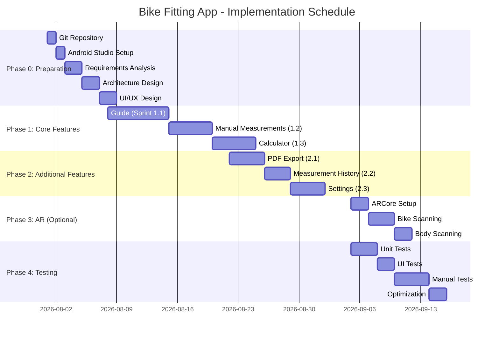

# 📅 **BIKE FITTING APP: IMPLEMENTATION PLAN**
**Version:** `1.0.0`
**Date:** `2026-08-01`
**Status:** `Draft`
**Author:** `0x-void Dev Team (AI-Assisted)`

---

## 🎯 **1. PROJECT SUMMARY**

| **Parameter**               | **Value**                                                                 |
|----------------------------|-----------------------------------------------------------------------------|
| **Goal**                    | Mobile application (Android) for **bike fitting** (gravel/road).           |
| **Technologies**             | Kotlin, Jetpack Compose, ARCore, Room, Hilt, iTextPDF.                     |
| **MVP Duration**      | **~6 weeks** (33 working days).                                            |
| **Team**                 | 1-2 developers + AI Agent (Vibe Coding).                                    |
| **Methodology**             | **Agile/Scrum** (2-week sprints).                                    |
| **MVP Deadline**            | **2026-09-15** (6 weeks from start).                                       |

---

## 📌 **2. PROJECT PHASES**

### **🔹 Phase 0: Preparation (1 week)**
**Goal:** Set up environment, analyze requirements, design architecture.

| **Task**                          | **Responsible**       | **Time** | **Status** | **Notes**                                  |
|--------------------------------------|--------------------------|----------|------------|--------------------------------------------|
| Create Git repository          | Dev                      | 1d       | ⏳         | GitHub/GitLab.                             |
| Configure Android Studio          | Dev                      | 1d       | ⏳         | JDK 17, Gradle, Kotlin.                    |
| Analyze standard bike fitting methods | AI Agent + Dev      | 2d       | ⏳         | Extract tables, formulas, instructions.   |
| Architecture design (MVVM)          | Dev                      | 2d       | ⏳         | Class diagrams, Use Cases, Repositories.    |
| UI/UX design (Figma)                | Dev/AI Agent             | 2d       | ⏳         | Screen mockups (Cyberpunk).               |
| **TOTAL**                            |                          | **8d**   |            |                                            |

**Result:**
- ✅ Repository with **`README.md`**, **`build.gradle`**, **project structure**.
- ✅ **Technical documentation** (architecture, UI mockups).
- ✅ **Reference tables** (integrated in code).

---

### **🔹 Phase 1: Core Implementation (2 weeks)**
**Goal:** Implement **guide, manual measurements, and calculator**.

| **Task**                          | **Responsible**       | **Time** | **Status** | **Notes**                                  |
|--------------------------------------|--------------------------|----------|------------|--------------------------------------------|
| **Sprint 1.1: Guide**            |                          |          |            |                                            |
| - Welcome screen + language selection     | Dev                      | 1d       | ⏳         | PL/EN, cyberpunk UI.                       |
| - Navigation (Bottom Nav + FAB)       | Dev                      | 1d       | ⏳         | Jetpack Compose.                           |
| - Guide screen (step list)   | Dev                      | 2d       | ⏳         | 7 steps with icons.                        |
| - Step details (text + illustrations)| Dev                      | 3d       | ⏳         | Markdown/HTML + illustrations.          |
| **Sprint 1.2: Manual Measurements**     |                          |          |            |                                            |
| - Input data form       | Dev                      | 2d       | ⏳         | Text fields, validation.                  |
| - Data model (Data Classes)         | Dev                      | 1d       | ⏳         | Kotlin `data class`.                       |
| - Local storage (Room)      | Dev                      | 2d       | ⏳         | `Measurements` table.                     |
| **Sprint 1.3: Calculator**            |                          |          |            |                                            |
| - Calculation logic (Use Cases)          | Dev                      | 3d       | ⏳         | Formulas from reference tables.      |
| - Results screen (table + visualization)| Dev                     | 2d       | ⏳         | SVG/Canvas bike diagram.                 |
| **TOTAL**                            |                          | **17d**  |            |                                            |

**Result:**
- ✅ **Step-by-step guide** (7 steps with content).
- ✅ **Manual measurements** (form + validation).
- ✅ **Calculator** (parameter calculation based on reference tables).

---

### **🔹 Phase 2: Additional Features (2 weeks)**
**Goal:** **PDF export, measurement history, settings**.

| **Task**                          | **Responsible**       | **Time** | **Status** | **Notes**                                  |
|--------------------------------------|--------------------------|----------|------------|--------------------------------------------|
| **Sprint 2.1: PDF Export**            |                          |          |            |                                            |
| - iTextPDF integration                 | Dev                      | 2d       | ⏳         | Document generation.                     |
| - Report template                     | Dev                      | 1d       | ⏳         | Template from Section 2.1.4 (Requirements).            |
| - Summary screen + PDF button   | Dev                      | 1d       | ⏳         | Share/Download.                            |
| **Sprint 2.2: Measurement History**       |                          |          |            |                                            |
| - History list (Room)               | Dev                      | 2d       | ⏳         | RecyclerView + Room Query.                 |
| - Measurement details                   | Dev                      | 1d       | ⏳         | Detail screen with data.                     |
| **Sprint 2.3: Settings**             |                          |          |            |                                            |
| - Settings screen                      | Dev                      | 1d       | ⏳         | Language, units, dark mode.             |
| - Localization (PL/EN)                 | Dev                      | 2d       | ⏳         | `strings.xml` + `values-pl/`.               |
| - Permission handling (Camera)          | Dev                      | 1d       | ⏳         | Runtime permissions.                      |
| **TOTAL**                            |                          | **11d**  |            |                                            |

**Result:**
- ✅ **PDF export** (report with measurements).
- ✅ **Measurement history** (local database).
- ✅ **Settings** (language, units, dark mode).

---

### **🔹 Phase 3: AR Measurements (Optional, 1 week)**
**Goal:** **Bike/body scanning using ARCore**.

| **Task**                          | **Responsible**       | **Time** | **Status** | **Notes**                                  |
|--------------------------------------|--------------------------|----------|------------|--------------------------------------------|
| **Sprint 3.1: ARCore Setup**          |                          |          |            |                                            |
| - ARCore integration                   | Dev                      | 2d       | ⏳         | Check device compatibility.    |
| - Plane detection (Plane Detection)| Dev                     | 2d       | ⏳         | Detect floor/bike.                 |
| **Sprint 3.2: Scanning**             |                          |          |            |                                            |
| - Bike scanning (saddle/handlebar height) | Dev               | 3d       | ⏳         | CameraX + ARCore.                          |
| - Body scanning (height, leg length)| Dev                      | 2d       | ⏳         | Pose Detection (optional).              |
| **TOTAL**                            |                          | **9d**   |            | **Optional (Post-MVP)**                  |

**Result:**
- ✅ **AR measurements** (for ARCore-supported devices).

---

### **🔹 Phase 4: Testing and Optimization (1 week)**
**Goal:** **Testing, fixes, performance optimization**.

| **Task**                          | **Responsible**       | **Time** | **Status** | **Notes**                                  |
|--------------------------------------|--------------------------|----------|------------|--------------------------------------------|
| **Sprint 4.1: Unit Tests**            |                          |          |            |                                            |
| - Calculator logic tests            | Dev                      | 2d       | ⏳         | JUnit 5.                                    |
| - Use Cases tests                    | Dev                      | 1d       | ⏳         | Mockito.                                   |
| **Sprint 4.2: UI Tests**              |                          |          |            |                                            |
| - Navigation tests                    | Dev                      | 1d       | ⏳         | Espresso.                                  |
| - Form tests                   | Dev                      | 1d       | ⏳         | Field validation.                            |
| **Sprint 4.3: Manual Tests**        |                          |          |            |                                            |
| - Physical device tests   | Dev + Tester (You)        | 2d       | ⏳         | Bike + user as tester.           |
| - Bug fixes                     | Dev                      | 2d       | ⏳         | Fix critical issues.                     |
| **Sprint 4.4: Optimization**         |                          |          |            |                                            |
| - APK size reduction               | Dev                      | 1d       | ⏳         | ProGuard, resource shrinking.             |
| - Performance improvement                  | Dev                      | 1d       | ⏳         | Profiling (Android Profiler).          |
| **TOTAL**                            |                          | **10d**  |            |                                            |

**Result:**
- ✅ **Application ready for production** (stable, tested).

---

## 📊 **3. SCHEDULE (GANTT CHART)**

---

## 🎯 **4. MILESTONES**

| **Milestone**               | **Date**       | **Acceptance Criteria**                                                                 | **Status** |
|-----------------------------|----------------|---------------------------------------------------------------------------------------|------------|
| **M1: Repository Ready** | 2026-08-07     | Git + Android Studio configured, project structure.                            | ⏳         |
| **M2: Guide Implemented** | 2026-08-15 | 7 steps display correctly, navigation works.                                | ⏳         |
| **M3: Measurements + Calculator** | 2026-08-22   | User can enter data and receive results.                                  | ⏳         |
| **M4: PDF Export**          | 2026-08-29     | PDF report generates correctly and contains all data.                         | ⏳         |
| **M5: Testing Complete**    | 2026-09-12     | All tests passed, no critical bugs.                                     | ⏳         |
| **M6: MVP Ready**           | 2026-09-15     | Application ready for Google Play publication.                                       | ⏳         |
| **M7: AR Implemented** | 2026-09-22     | AR measurements work on ARCore-supported devices.                                         | ⏳         |

---

## 🛠️ **5. RESOURCES AND TOOLS**

| **Category**               | **Tool**               | **Purpose**                                                                 |
|-----------------------------|-------------------------|--------------------------------------------------------------------------|
| **IDE**                     | Android Studio (Giraffe)    | Main development environment.                                        |
| **Language**                   | Kotlin                      | Primary application language.                                                  |
| **UI Framework**            | Jetpack Compose             | User interface development.                                           |
| **Architecture**            | MVVM + Clean Architecture   | Separation of presentation layer from logic.                              |
| **Dependency Injection**     | Hilt                        | Dependency management.                                               |
| **Database**             | Room                        | Local storage of measurement history.                                |
| **AR**                      | ARCore                      | 3D scanning of bike/body.                                               |
| **Camera**                  | CameraX                     | Device camera handling.                                              |
| **PDF**                     | iTextPDF                    | PDF report generation.                                                |
| **Version Control**           | Git + GitHub                | Version control, collaboration.                                             |
| **CI/CD**                   | GitHub Actions              | Automatic APK building.                                              |
| **Tests**                   | JUnit 5, Espresso            | Unit and UI tests.                                                  |
| **UI Design**               | Figma                       | Screen mockups (Cyberpunk).                                              |
| **Documentation**             | Markdown (Canvases)         | Guidelines, requirements, plan.                                                |

---

## 🚨 **6. RISKS AND MITIGATION**

| **Risk**                          | **Probability** | **Impact** | **Mitigation**                                                                 |
|--------------------------------------|----------------|------------|-------------------------------------------------------------------------------|
| **No ARCore support on device** | High                | Medium   | Check compatibility at startup. Hide AR option if unavailable.     |
| **Complexity of calculations (tables)**       | Medium                | High   | Simplify formulas, use **lookup tables** (instead of complex formulas). |
| **Performance issues**            | Low                 | High   | Profiling (Android Profiler), code optimization.                       |
| **Data validation errors**          | Medium                | Medium   | Unit tests (JUnit) + manual tests.                                     |
| **Changing requirements**                   | Low                 | High   | Regular meetings with client (You).                                      |
| **No tests on physical devices** | Medium          | High   | Use **emulator + at least 2 physical devices** (e.g., Pixel, Samsung). |

---

## 📝 **7. DEFINITION OF DONE (DoD)**

### **🔹 For Each Task:**
- [ ] Code **compiled and working** on test device.
- [ ] **Unit tests** passed (coverage > 80%).
- [ ] **UI tests** passed (Espresso).
- [ ] **Code reviewed** (Code Review).
- [ ] **Documentation** updated (comments, README).

### **🔹 For MVP:**
- [ ] All **Must-Have** features implemented.
- [ ] **No critical bugs** (blocking usage).
- [ ] **Performance** meets requirements (startup time <2s, memory <100MB).
- [ ] **Application works offline** (100% functionality).
- [ ] **Translations** (PL/EN) complete.
- [ ] **PDF export** works correctly.

---

## 📌 **8. COMMUNICATION**
- **Daily Standups:** Short (15 min) meetings **daily** (if team >1).
- **Sprint Review:** Every **2 weeks** (progress review).
- **Sprint Retrospective:** Every **2 weeks** (process improvements).
- **Tools:** Slack (communication), GitHub (issues), Figma (UI).

---

## 🎉 **9. SUMMARY**
- **MVP Time:** **6 weeks** (33 working days).
- **Cost:** ~**100-150 hours of work** (1-2 devs).
- **Technologies:** Kotlin, Jetpack Compose, ARCore, Room, Hilt.
- **Result:** **Application ready for Google Play publication**.

---

**🔹 Signature:**
*Plan approved for implementation. Last updated: `2026-08-01`.*
**Keep your eyes open, Netrunner.** 🚴‍♂️💻