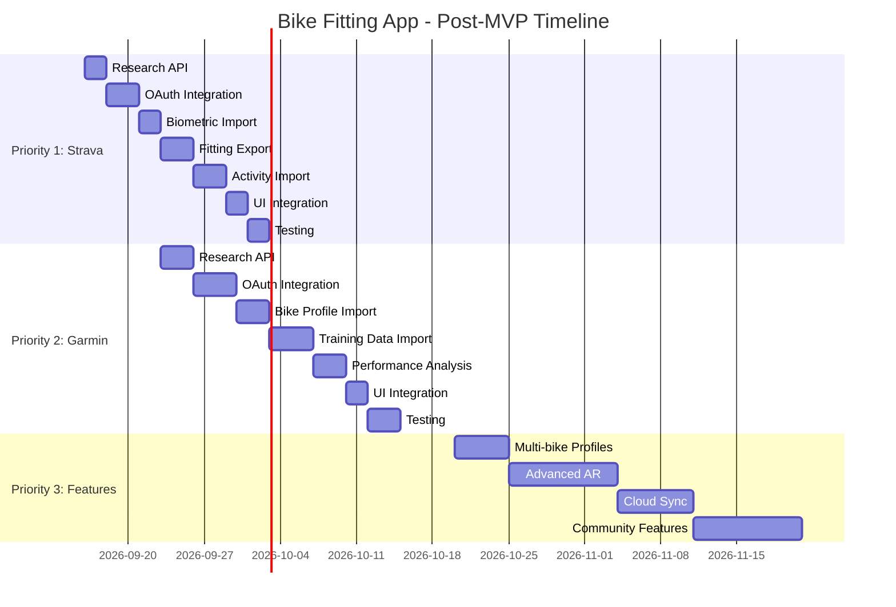

# 🚀 **BIKE FITTING APP: POST-MVP ROADMAP**
**Version:** `1.0.0`
**Date:** `2026-08-01`
**Status:** `Draft`
**Author:** `0x-void Dev Team (AI-Assisted)`

---

## 🎯 **1. INTRODUCTION**
This document defines the **development plan for *Bike Fitting App* after MVP release**, with particular focus on **external platform integrations** (Strava, Garmin) and **new features** that **increase user value**. 

**Goals:**
- **Automation** (data import/export).
- **Personalization** (suggestions based on training data).
- **Performance Analysis** (before/after bike fitting comparison).

**Scope:** Integrations **not implemented in MVP** (due to **offline-first** and **priorities**).

---

## 📈 **2. POST-MVP PRIORITIES**

### **🥇 Priority 1: Strava Integration**
**Timeline:** **2-3 weeks after MVP** (Sprint 5).
**Business Value:** **High** (Strava is **#1 platform for cyclists**).

---

### **🥈 Priority 2: Garmin Integration**
**Timeline:** **4-5 weeks after MVP** (Sprint 6).
**Business Value:** **Medium-High** (Garmin dominates in **cycling devices**).

---

### **🥉 Priority 3: Additional Features**
**Timeline:** **6+ weeks after MVP** (Sprint 7+).
**Business Value:** **Depends on user feedback**.

---

## 🔗 **3. STRAVA INTEGRATION**

### **3.1 User Benefits**

| **Benefit**                          | **Description**                                                                                     | **Use Case Example**                                                                                     |
|--------------------------------------|---------------------------------------------------------------------------------------------|-------------------------------------------------------------------------------------------------------|
| **Biometric Data Import**     | Automatic fetching of **height, weight, age** from Strava profile.                         | User **doesn't need to manually enter** height - app **pulls it from Strava**.                     |
| **Bike Fitting Results Export**      | Saving **bike fitting report** as **notes for activities** in Strava.              | After bike adjustment, user sees in Strava: *"Bike fitting session: Saddle height adjusted to 780mm, handlebar height 680mm"*.                     |
| **Activity Data Analysis** | Import **ride data** (distance, speed, cadence, power) to analyze **bike fitting impact**. | Compare **before/after** bike fitting: *"Power increased by 15% after saddle adjustment"*. |
| **Automatic Sync** | **Two-way synchronization** of bike fitting data with Strava. | Changes in Strava profile **automatically update** in Bike Fitting App. |

### **3.2 Technical Requirements**

| **Requirement**               | **Details**                                                                                     | **Implementation** |
|------------------------------|---------------------------------------------------------------------------------------------|------------------|
| **Strava API Access** | OAuth 2.0 authentication. | `com.strava:strava-android:2.0.0` |
| **API Endpoints** | `/athlete`, `/activities`, `/gear`. | REST API calls. |
| **Permissions** | `activity:read`, `activity:write`, `profile:read`. | Request during login. |
| **Rate Limits** | 100 requests/hour (free tier). | Implement caching. |

### **3.3 Implementation Plan**

| **Task** | **Estimated Time** | **Dependencies** | **Notes** |
|----------|-------------------|-----------------|-------|
| Research Strava API | 2d | Documentation | Focus on athlete profile and activities. |
| OAuth 2.0 Integration | 3d | Strava SDK | Handle token refresh. |
| Biometric Data Import | 2d | API calls | Height, weight, age. |
| Bike Fitting Export | 3d | API calls | Save as activity notes. |
| Activity Data Import | 3d | API calls | For performance analysis. |
| UI Integration | 2d | Compose | Settings screen + connection flow. |
| Testing | 2d | Manual | Verify on multiple accounts. |
| **Total** | **17d** | | |

### **3.4 Code Example (Kotlin)**

```kotlin
// StravaService.kt
interface StravaService {
    suspend fun getAthleteInfo(): StravaAthlete
    suspend fun exportBikeFittingReport(report: BikeFittingReport): Boolean
    suspend fun getRecentActivities(limit: Int = 10): List<StravaActivity>
}

// StravaRepository.kt
class StravaRepositoryImpl @Inject constructor(
    private val stravaService: StravaService
) : StravaRepository {
    override suspend fun importBiometricData(): UserBiometrics {
        val athlete = stravaService.getAthleteInfo()
        return UserBiometrics(
            heightCm = athlete.height?.toInt() ?: 0,
            weightKg = athlete.weight?.toInt() ?: 0,
            age = athlete.age ?: 0
        )
    }
}

// StravaAuthActivity.kt
@AndroidEntryPoint
class StravaAuthActivity : ComponentActivity() {
    @Inject lateinit var stravaAuth: StravaAuth
    
    private val viewModel: StravaViewModel by viewModels()
    
    @Composable
    override fun Content() {
        StravaAuthScreen(
            isConnected = viewModel.isConnected,
            onConnectClick = { viewModel.connectToStrava() },
            onDisconnectClick = { viewModel.disconnect() }
        )
    }
}
```

### **3.5 API Endpoints**

| **Endpoint** | **Method** | **Description** | **Example Response** |
|--------------|------------|-----------------|---------------------|
| `/oauth/token` | POST | Get access token | `{ "access_token": "...", "expires_in": 21600 }` |
| `/athlete` | GET | Get athlete profile | `{ "height": 180.0, "weight": 75.0, "age": 30 }` |
| `/activities` | GET | Get recent activities | `[ { "id": 123, "distance": 50000, "average_speed": 25.5 } ]` |
| `/activities/{id}` | POST | Add note to activity | `{ "id": 123, "description": "Bike fitting: ..." }` |

---

## 📊 **4. GARMIN INTEGRATION**

### **4.1 User Benefits**

| **Benefit** | **Description** | **Use Case Example** |
|-------------|-----------------|---------------------|
| **Device Data Sync** | Import **bike sensor data** (speed, cadence, power, heart rate). | Sync **Garmin Edge** data with bike fitting calculations. |
| **Bike Profile Import** | Import **bike geometry** from Garmin Connect. | Automatically populate bike measurements. |
| **Training Analysis** | Correlate **bike fitting** with **performance metrics**. | *"Your power output improved by 10% after handlebar adjustment"*. |
| **Workout Suggestions** | Generate **personalized bike fitting recommendations** based on training data. | Suggest saddle height based on **average cadence**. |

### **4.2 Technical Requirements**

| **Requirement** | **Details** | **Implementation** |
|---------------|-------------|------------------|
| **Garmin Connect API** | OAuth 2.0 authentication. | `com.garmin:connect-api:1.5.0` |
| **API Endpoints** | `/userinfo`, `/activities`, `/devices`. | REST API calls. |
| **Permissions** | `userinfo.read`, `activities.read`, `devices.read`. | Request during login. |
| **Rate Limits** | 500 requests/hour. | Implement caching + batch requests. |

### **4.3 Implementation Plan**

| **Task** | **Estimated Time** | **Dependencies** | **Notes** |
|----------|-------------------|-----------------|-------|
| Research Garmin API | 3d | Documentation | More complex than Strava. |
| OAuth 2.0 Integration | 4d | Garmin SDK | Handle token refresh + device pairing. |
| Bike Profile Import | 3d | API calls | Geometry, components. |
| Training Data Import | 4d | API calls | Activities, metrics. |
| Performance Analysis | 3d | Data processing | Correlate fitting with performance. |
| UI Integration | 2d | Compose | Settings screen + connection flow. |
| Testing | 3d | Manual + Device | Verify on Garmin Edge, Forerunner. |
| **Total** | **22d** | | |

### **4.4 Code Example (Kotlin)**

```kotlin
// GarminService.kt
interface GarminService {
    suspend fun getUserInfo(): GarminUser
    suspend fun getBikeProfile(): BikeProfile
    suspend fun getRecentActivities(limit: Int = 10): List<GarminActivity>
}

// GarminRepository.kt
class GarminRepositoryImpl @Inject constructor(
    private val garminService: GarminService
) : GarminRepository {
    override suspend fun importBikeProfile(): BikeGeometry {
        val profile = garminService.getBikeProfile()
        return BikeGeometry(
            frameSize = profile.frameSizeMm,
            saddleHeight = profile.saddleHeightMm,
            handlebarWidth = profile.handlebarWidthMm
        )
    }
}
```

---

## 🎯 **5. ADDITIONAL POST-MVP FEATURES**

### **5.1 Feature List**

| **Feature** | **Priority** | **Estimated Time** | **Description** |
|-------------|-------------|-------------------|-----------------|
| **Multi-bike Profiles** | High | 5d | Save multiple bike configurations. |
| **Advanced AR Features** | High | 10d | 3D bike model, real-time adjustments. |
| **Cloud Sync** | Medium | 7d | Sync data across devices (Firebase). |
| **Community Features** | Medium | 10d | Share bike fitting results, compare with others. |
| **AI Recommendations** | Low | 14d | ML-based suggestions (requires training data). |
| **Voice Guidance** | Low | 5d | Step-by-step voice instructions. |
| **Wear OS Integration** | Low | 10d | Companion app for smartwatches. |

### **5.2 Feature Details**

#### **Multi-bike Profiles**
- **User Story:** *"As a cyclist with multiple bikes, I want to save different bike fitting configurations for each bike."*
- **Implementation:**
  - Database schema update (add `bikeId` to measurements).
  - UI for bike selection and management.
  - Export/import bike profiles.

#### **Advanced AR Features**
- **3D Bike Model:** Visualize bike with measurements overlaid.
- **Real-time Adjustments:** See changes before applying them.
- **AR Tutorials:** Step-by-step AR-guided bike fitting.
- **Technical:** ARCore + Sceneform + custom 3D models.

#### **Cloud Sync**
- **Backend:** Firebase Firestore (free tier sufficient).
- **Sync Strategy:** Manual sync + auto-sync on WiFi.
- **Conflict Resolution:** Last write wins + versioning.
- **Security:** Firebase Authentication (email/password, Google).

#### **Community Features**
- **Share Results:** Export bike fitting as shareable link.
- **Compare:** See how your measurements compare to others (anonymous).
- **Discussions:** Forum for bike fitting tips and questions.
- **Leaderboards:** Top bike fitters (gamification).

---

## 📅 **6. POST-MVP TIMELINE**



---

## 📊 **7. SUCCESS METRICS**

| **Metric** | **Target** | **Measurement Method** |
|------------|------------|----------------------|
| **Strava Integration Adoption** | 60% of users | Track connection rate. |
| **Garmin Integration Adoption** | 40% of users | Track connection rate. |
| **User Retention (30-day)** | +20% increase | Compare pre/post integration. |
| **App Store Rating** | 4.5+ stars | Monitor reviews. |
| **Feature Usage** | 70% of users use at least one integration | Analytics. |

---

## 🚨 **8. RISKS AND MITIGATION**

| **Risk** | **Probability** | **Impact** | **Mitigation** |
|----------|----------------|------------|----------------|
| **API Changes (Strava/Garmin)** | Medium | High | Use versioned APIs, implement fallback. |
| **Authentication Issues** | Medium | High | Store tokens securely, handle refresh. |
| **Rate Limit Exceeded** | Low | Medium | Implement caching, batch requests. |
| **User Data Privacy** | Medium | High | Encrypt data, comply with GDPR. |
| **Integration Complexity** | High | Medium | Break into smaller tasks, prioritize. |

---

## 📌 **9. DEPENDENCIES**

| **Integration** | **Library/Service** | **License** | **Cost** |
|-----------------|-------------------|------------|----------|
| **Strava API** | Strava Android SDK | Free (rate limits) | $0 |
| **Garmin Connect API** | Garmin SDK | Free (rate limits) | $0 |
| **Firebase** | Firebase Firestore, Auth | Free tier available | $0 (free tier) |
| **ARCore** | Google ARCore | Free | $0 |

---

## 🎉 **10. SUMMARY**
- **Total Post-MVP Time:** ~**8 weeks** (40 working days).
- **Priority Order:** Strava → Garmin → Additional Features.
- **Expected Impact:** Significant increase in user engagement and retention.
- **Next Steps:** Start with Strava integration after MVP release.

---

**🔹 Signature:**
*Roadmap approved for implementation. Last updated: `2026-08-01`.*
**Keep your eyes open, Netrunner.** 🚴‍♂️💻