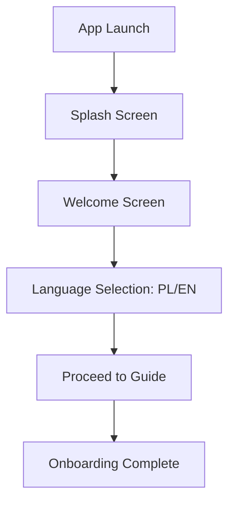
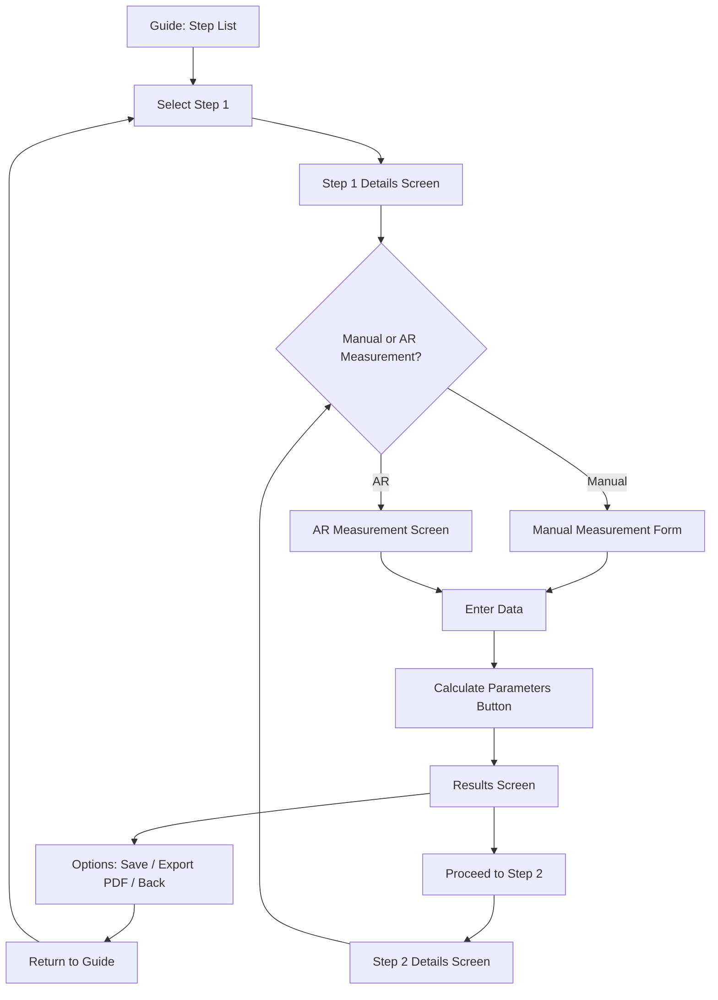
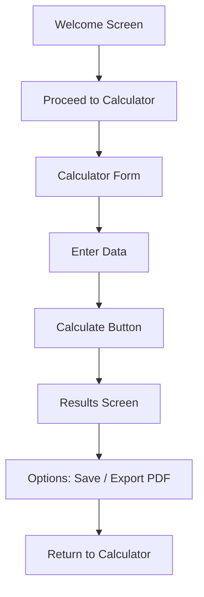
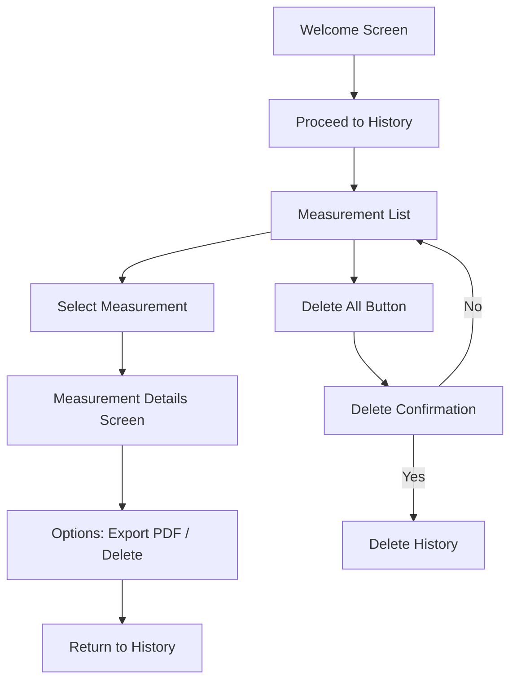
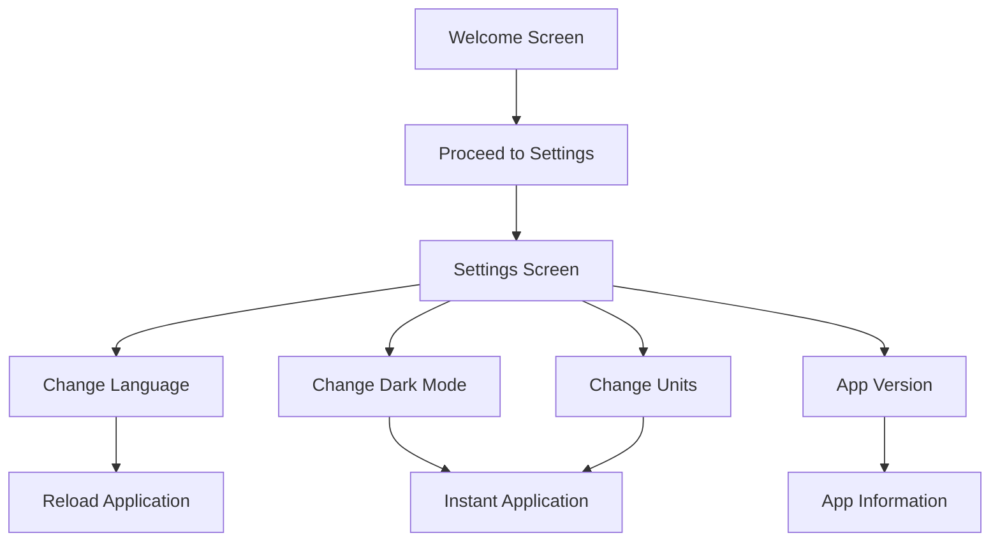
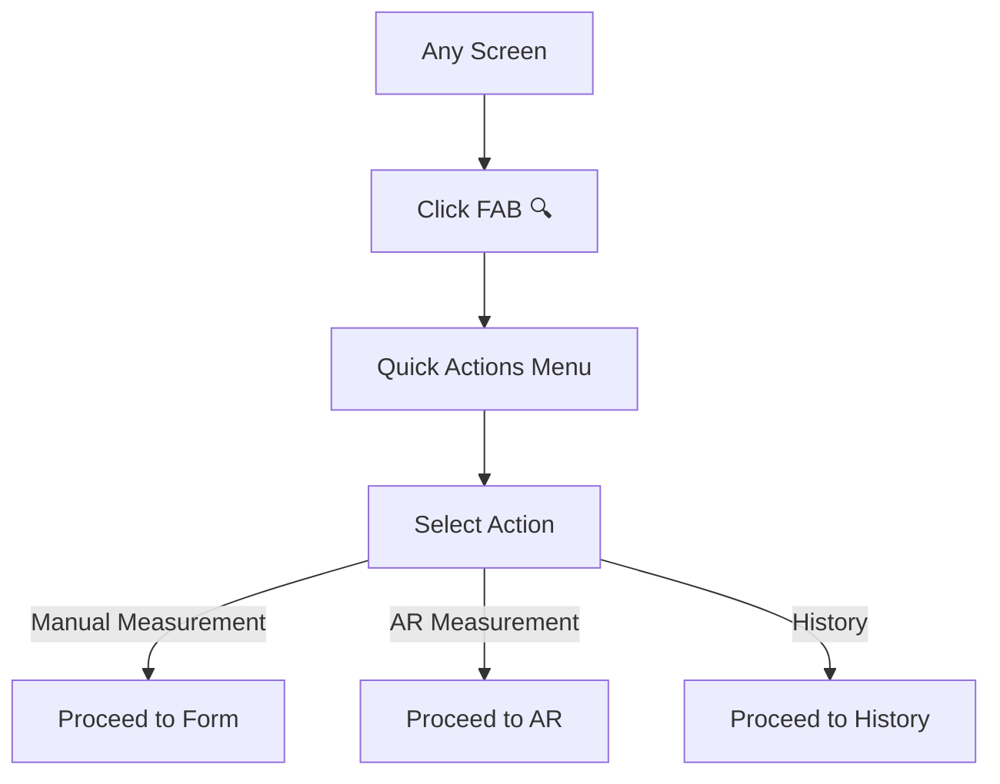
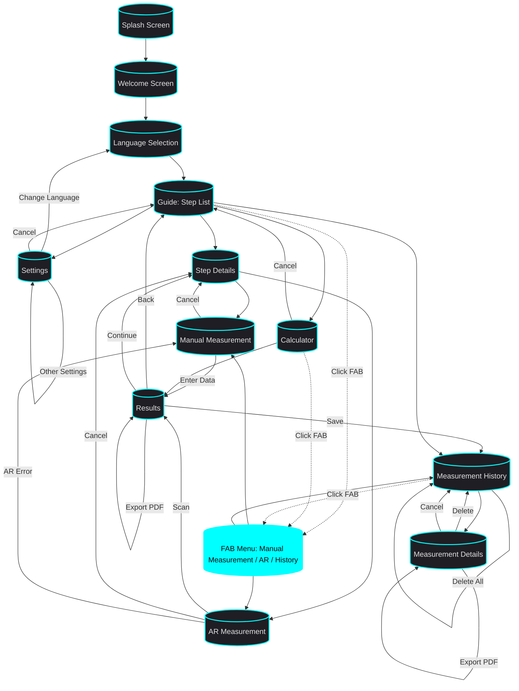
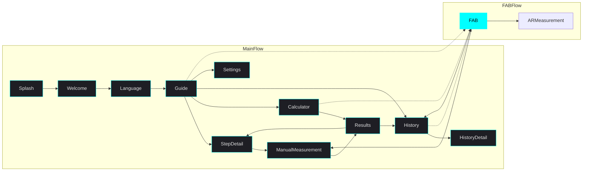

# 🎯 **BIKE FITTING APP: USER INTERACTION FLOW**
**Version:** `1.0.0`
**Date:** `2026-08-01`
**Status:** `Draft`
**Author:** `0x-void Dev Team (AI-Assisted)`

---

## 📌 **1. INTRODUCTION**
This document describes **all possible user interaction paths** with the *Bike Fitting App*, from **first launch** to **PDF report export**. 

**Goals:**
- **Define clear flows** for developers and AI Agent.
- **Ensure UX consistency** across screens.
- **Identify exit points** (e.g., measurement cancellation).

**Scope:** Flow for **MVP** (offline, no external integrations).

---

## 🧭 **2. MAIN USER SCENARIOS**

### **🔹 Scenario 1: First Launch (Onboarding)**
**Goal:** User **starts using the app for the first time**.



**Steps:**
1. **Splash Screen** (2-3s) → **Automatic transition** to welcome screen.
2. **Welcome Screen** → User sees **app purpose** + **"Get Started"** button.
3. **Language Selection** → User selects **PL or EN** (default: EN).
4. **Proceed to Guide** → **Main app screen** (list of 7 steps).

**Exit Points:**
- **None** (user **must** select language to continue).

---

### **🔹 Scenario 2: Step-by-Step Guide (Core Flow)**
**Goal:** User **goes through 7 bike fitting steps**.



**Steps:**
1. **Guide** → User sees **list of 7 steps** (cards with icons).
2. **Select step** → Click on **step 1** (Saddle Height).
3. **Step details** → User reads **instructions + views illustration**.
4. **Measurement method selection:**
   - **Manual Measurement** → Form with fields (height, leg length, etc.).
   - **AR Measurement** → Bike/body scanning (optional).
5. **Enter data** → User **enters values** (manually) or **app retrieves them from AR**.
6. **Calculation** → User clicks **"Calculate Parameters"** → **proceeds to results screen**.
7. **Results** → User sees **summary + recommendations**.
8. **Options:**
   - **Save** → Results **saved in history**.
   - **Export PDF** → Generate **PDF report**.
   - **Back** → Return to **step list**.
   - **Continue** → Proceed to **step 2**.

**Exit Points:**
- **Cancel measurement** → Return to **step list** ("❌" button in form).
- **Exit AR** → Return to **measurement method selection** (if AR fails).

---

### **🔹 Scenario 3: Calculator (Quick Calculations)**
**Goal:** User **wants to quickly calculate parameters** without going through the guide.



**Steps:**
1. **Proceed to Calculator** → User clicks **"Calculator"** in Bottom Nav.
2. **Form** → User enters **input data** (height, bike type, etc.).
3. **Calculation** → Click **"Calculate"** → **display results**.
4. **Results** → User sees **calculated parameters** (saddle height, distance, etc.).
5. **Options:**
   - **Save** → Results **saved in history**.
   - **Export PDF** → Generate **PDF report**.
   - **Back** → Return to **calculator** (to calculate for another bike).

**Exit Points:**
- **Cancel** → Return to **welcome screen** ("❌" button).

---

### **🔹 Scenario 4: Measurement History**
**Goal:** User **wants to review previous measurements**.



**Steps:**
1. **Proceed to History** → User clicks **"History"** in Bottom Nav.
2. **Measurement list** → User sees **list of previous sessions** (date, bike type).
3. **Select measurement** → Click on **measurement** → **display details**.
4. **Measurement details** → User sees **all parameters** from that session.
5. **Options:**
   - **Export PDF** → Generate **PDF report** for selected measurement.
   - **Delete** → Delete **selected measurement**.
   - **Back** → Return to **measurement list**.
6. **Delete All** → User can **delete entire history** (with confirmation).

**Exit Points:**
- **Cancel** → Return to **measurement list** ("❌" button).

---

### **🔹 Scenario 5: Settings**
**Goal:** User **wants to customize the app** to their preferences.



**Steps:**
1. **Proceed to Settings** → User clicks **"Settings"** in Bottom Nav.
2. **Settings screen** → User sees **settings categories** (Language, Appearance, Sound, etc.).
3. **Change settings:**
   - **Language** → Change **PL/EN** → **reload application** (for changes to take effect).
   - **Dark mode** → Toggle **ON/OFF** → **instant change**.
   - **Units** → Select **Metric/Imperial** → **instant change**.
   - **Sound** → Toggle **ON/OFF** → **instant change**.
4. **Information** → User can **check app version** and **read privacy policy**.

**Exit Points:**
- **Cancel** → Return to **welcome screen** ("❌" button).

---

### **🔹 Scenario 6: FAB (Quick Actions)**
**Goal:** User **wants to quickly start measurement** from any screen.



**Steps:**
1. **Click FAB** → On **every screen** (except Settings) **Floating Action Button (🔍)** is visible.
2. **Quick actions menu** → After clicking FAB, **menu appears** with options:
   - **📏 Manual Measurement** → Proceeds to **manual measurement form**.
   - **📷 AR Measurement** → Proceeds to **AR screen** (if available).
   - **📊 History** → Proceeds to **measurement history screen**.
3. **Select action** → User selects **one option** and **proceeds to appropriate screen**.

**Exit Points:**
- **Cancel** → Click **outside menu** → **close menu**.

---

## 🔄 **3. FULL INTERACTION FLOW DIAGRAM**



---

## 🎯 **4. ALTERNATIVE SCENARIOS**

### **🔹 Scenario A: ARCore Error**
**Problem:** Device **does not support ARCore** or **camera is unavailable**.

**Flow:**
1. User clicks **"AR Measurement"** → **compatibility check**.
2. **Error:** *"Your device does not support ARCore. Please select manual measurement."*
3. **Automatic redirect** to **manual measurement**.

**Diagram:**
```mermaid
flowchart TD
    A[Click "AR Measurement"] --> B{ARCore Available?}
    B -->|✅ Yes| C[AR Screen]
    B -->|❌ No| D[Error Message]
    D --> E[Redirect to Manual Measurement]
```

---

### **🔹 Scenario B: Missing Input Data**
**Problem:** User **did not enter required data** (e.g., height).

**Flow:**
1. User clicks **"Calculate Parameters"** → **field validation**.
2. **Error:** *"Please enter height to continue."*
3. **Highlight fields** with errors (red border).
4. User **enters missing data** → **re-validation**.

**Diagram:**
```mermaid
flowchart TD
    A[Click "Calculate"] --> B{All Data Entered?}
    B -->|✅ Yes| C[Calculate Results]
    B -->|❌ No| D[Display Validation Errors]
    D --> E[Highlight Empty Fields]
    E --> F[User Completes Data]
    F --> A
```

---

### **🔹 Scenario C: PDF Export (Insufficient Storage)**
**Problem:** Device **does not have enough space** to save PDF.

**Flow:**
1. User clicks **"Export PDF"** → **check available storage**.
2. **Error:** *"Insufficient storage. Please delete unnecessary files."*
3. **Options:**
   - **Delete old measurements** (redirect to History).
   - **Cancel** (return to Results).

**Diagram:**
```mermaid
flowchart TD
    A[Click "Export PDF"] --> B{Storage Available?}
    B -->|✅ Yes| C[Generate PDF]
    B -->|❌ No| D[Error Message]
    D --> E[Options: Delete Measurements / Cancel]
    E -->|Delete Measurements| F[Redirect to History]
    E -->|Cancel| G[Return to Results]
```

---

## 📋 **5. FLOW MATRIX (SCREEN → ACTION → TARGET)**

| **Screen** | **User Action** | **Purpose** | **Next Screen** | **Alternative** |
|------------|-----------------|-------------|----------------|----------------|
| Splash Screen | Waiting | Load application | Welcome Screen | - |
| Welcome Screen | Click "Get Started" | Proceed to guide | Language Selection | - |
| Language Selection | Select PL/EN | Set language | Guide | - |
| Guide | Click on step | Display step details | Step Details | - |
| Guide | Click "Calculator" | Quick calculations | Calculator | - |
| Guide | Click "History" | Browse previous measurements | Measurement History | - |
| Guide | Click "Settings" | Customize application | Settings | - |
| Step Details | Click "Manual Measurement" | Enter data manually | Manual Measurement | - |
| Step Details | Click "AR Measurement" | Scan bike/body | AR Measurement | Manual Measurement (if AR unavailable) |
| Manual Measurement | Enter data + "Calculate" | Calculate parameters | Results | Step Details (cancel) |
| AR Measurement | Scan + "Save" | Save AR measurements | Results | Step Details (cancel) |
| Results | Click "Save" | Save to history | Measurement History | - |
| Results | Click "Export PDF" | Generate report | PDF Preview / Share | Results (cancel) |
| Results | Click "Continue" | Proceed to next step | Step Details (Step 2) | - |
| Results | Click "Back" | Return to step list | Guide | - |
| Calculator | Enter data + "Calculate" | Calculate parameters | Results | Guide (cancel) |
| Measurement History | Click on measurement | Display details | Measurement Details | - |
| Measurement Details | Click "Export PDF" | Generate report for measurement | PDF Preview | History (cancel) |
| Measurement Details | Click "Delete" | Delete measurement | Measurement History | - |
| Measurement History | Click "Delete All" | Delete entire history | Delete Confirmation | - |
| Settings | Change language | Reload application | Welcome Screen | - |
| Settings | Change dark mode | Immediate UI change | Settings | - |
| Any Screen | Click FAB (🔍) | Quick access to actions | FAB Menu | - |

---

## 🎨 **6. FLOW VISUALIZATION (SIMPLIFIED)**



---

## 🔍 **7. EXIT POINTS AND ERRORS**

| **Screen** | **Action** | **Error** | **App Response** |
|------------|------------|-----------|------------------|
| AR Measurement | Start ARCore | Device does not support ARCore | Display message + **redirect to Manual Measurement** |
| AR Measurement | Scanning | No flat surface / bad angle | Display **instructions** (e.g., "Place bike on flat surface") |
| Manual Measurement | Enter data | Missing required fields (e.g., height) | **Highlight empty fields** + display message |
| Manual Measurement | Calculate | Values out of range (e.g., height = 300cm) | Display **message** (e.g., "Height should be between 100-220 cm") |
| Results | Export PDF | Insufficient storage | Display **message** + option to delete old measurements |
| Results | Export PDF | PDF generation error | Display **message** (e.g., "An error occurred. Please try again.") |
| Measurement History | Delete measurement | Database deletion error | Display **message** + return to list |

---

## 📌 **8. SUMMARY**

### **🔹 Main Paths:**
1. **Onboarding** → Splash → Welcome → Language → Guide.
2. **Guide** → Step by step (manual/AR) → Results → History.
3. **Calculator** → Enter data → Results → History.
4. **History** → Browse/delete measurements.
5. **Settings** → Customize application.
6. **FAB** → Quick access to measurements/history.

### **🔹 Key Points:**
- **Bottom Navigation** → Always visible (Guide, Calculator, History, Settings).
- **FAB** → Quick actions (Manual/AR Measurement/History).
- **Validation** → Always **validate input data** before calculations.
- **Errors** → **Clear messages** + **recovery options** (e.g., "Go to Manual Measurement").
- **Offline** → **Everything works without internet** (MVP).

### **🔹 UX Rules:**
- **Step by step** → User **knows what to do** (instructions + illustrations).
- **Minimal clicks** → **Maximum 3 clicks** to goal (e.g., Guide → Step 1 → Measurement).
- **Visual feedback** → **Field highlighting, messages, animations** (e.g., FAB pulsing).
- **Consistency** → **Same components** (buttons, cards) on all screens.

---

**🔹 Signature:**
*Document approved for implementation. Last updated: `2026-08-01`.*
**Stay safe on the Net, Netrunner.** 🚴‍♂️💻