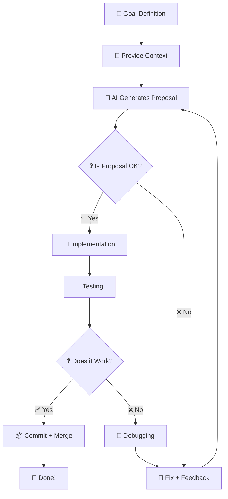

# 🤖 **BIKE FITTING APP: VIBE CODING METHODOLOGY**
**Version:** `1.0.0`
**Date:** `2026-08-01`
**Status:** `Draft`
**Author:** `0x-void Dev Team (AI-Assisted)`

---

## 🎯 **1. INTRODUCTION**
This document describes the **work methodology** with the **AI agent (Vibe Coding)** and the **development process** for the *Bike Fitting App* project.

**Goal:** Ensure **consistent, repeatable, and efficient collaboration** between the **developer (You, Ziomek)** and the **AI Agent** (Mistral/Le Chat).

---

## 🤖 **2. VIBE CODING: AI AGENT GUIDE**

### **2.1 What is Vibe Coding?**
**Vibe Coding** is a **collaboration paradigm between human and AI**, where:
- **Human** (You) **defines the goal, requirements, and context**.
- **AI Agent** **implements, optimizes, and proposes solutions**.
- **Collaboration** proceeds in a **feedback loop**.

**Vibe Coding Rules:**
1. **🎯 Goal is Paramount** - AI always **adapts to your requirements**, not the other way around.
2. **📜 Context is Key** - The more **documentation, examples, and guidelines** you provide, the better the results.
3. **🔄 Iteration > Perfection** - Better to have **quick prototypes + fixes** than long analysis.
4. **🛠️ Tools Matter** - Use **appropriate tools** (Android Studio, Git, ARCore) and **integrations** (Vibe Work).
5. **🧠 AI is a Partner, Not a Tool** - Treat AI as an **experienced developer** who **proposes, but does not decide**.

---

### **2.2 Role of AI Agent in the Project**

| **Task**                          | **AI Role**                                                                 | **Human Role (You)**                                                                 |
|--------------------------------------|----------------------------------------------------------------------------|---------------------------------------------------------------------------------------|
| **Requirements Analysis**                  | Proposes **data structures, formulas, reference tables**.            | **Approves/rejects** proposals, provides **context** (e.g., bike fitting standards).        |
| **Architecture Design**              | Generates **class diagrams, Use Cases, skeleton code**.                    | **Verifies** correctness, adjusts to **best practices** (MVVM, Clean Architecture). |
| **Code Implementation**               | Writes **Kotlin, Jetpack Compose, Room, ARCore**.                            | **Reviews code**, tests, fixes bugs.                                             |
| **Testing**                       | Generates **unit tests (JUnit)**, **test scenarios**.           | **Runs tests**, verifies results on **physical devices**.                  |
| **Optimization**                    | Proposes **performance improvements** (e.g., ProGuard, coroutines).            | **Accepts/rejects** changes, monitors **memory/CPU usage**.                      |
| **Documentation**                      | Creates **technical documentation, code comments**.                    | **Edits**, supplements **missing context**.                                         |
| **Debugging**                         | Analyzes **logs, stack traces**, proposes **fixes**.                       | **Confirms correctness**, tests on **bike (test object)**.                 |

---

### **2.3 Vibe Coding Workflow (Step by Step)**



**Details:**
1. **🎯 Goal Definition**
   - **You:** Define the **goal** (e.g., *"Implement step 1 of the bike fitting guide").*
   - **AI:** Asks clarifying questions if needed.

2. **📜 Provide Context**
   - **You:** Provide **documentation, examples, screenshots, code snippets**.
   - **AI:** Uses context to generate **accurate proposals**.

3. **🤖 AI Generates Proposal**
   - **AI:** Provides **code, architecture, or design solutions**.
   - **You:** Review and provide **feedback**.

4. **❓ Is Proposal OK?**
   - **✅ Yes:** Proceed to implementation.
   - **❌ No:** Return to step 2 with corrections.

5. **🚀 Implementation**
   - **AI/You:** Implement the solution.
   - **You:** Verify the implementation.

6. **🧪 Testing**
   - **You:** Test on **emulator and physical devices**.
   - **AI:** Helps identify edge cases.

7. **❓ Does it Work?**
   - **✅ Yes:** Commit and merge.
   - **❌ No:** Debug and return to step 5.

---

## 🛠️ **3. DEVELOPMENT PROCESS**

### **3.1 Development Environment Setup**
- **IDE:** Android Studio Giraffe + JDK 17.
- **Language:** Kotlin 100%.
- **Build System:** Gradle (KTS).
- **Version Control:** Git + GitHub.
- **Project Structure:** Clean Architecture + MVVM.

### **3.2 Coding Standards**
- **Naming:** `camelCase` for variables/functions, `PascalCase` for classes.
- **Comments:** English, concise, for complex logic only.
- **Code Style:** Follow Kotlin style guide.
- **Commits:** Atomic, descriptive messages in English.

### **3.3 Branch Strategy**
- **Main:** `main` (production-ready).
- **Development:** `dev` (integration branch).
- **Features:** `feature/[name]` (e.g., `feature/step-guide`).
- **Bugfixes:** `fix/[name]` (e.g., `fix/ar-scan`).
- **Pull Requests:** Required for merging to `dev`/`main`.

### **3.4 Testing Strategy**
- **Unit Tests:** JUnit 5 + Mockito (coverage > 80%).
- **UI Tests:** Espresso (critical user flows).
- **Manual Tests:** Physical devices (Pixel, Samsung).
- **AR Tests:** ARCore-supported devices only.

### **3.5 Code Review Process**
1. Create Pull Request.
2. AI Agent reviews code.
3. Human developer verifies.
4. Address feedback.
5. Merge after approval.

---

## 📊 **4. TOOLS AND INTEGRATIONS**

| **Category**               | **Tool**               | **Purpose**                                                                 |
|-----------------------------|-------------------------|--------------------------------------------------------------------------|
| **IDE**                     | Android Studio (Giraffe)    | Main development environment.                                        |
| **AI Assistance**           | Vibe Work / Le Chat          | Code generation, optimization, debugging.                                |
| **Version Control**         | Git + GitHub              | Version control, collaboration.                                            |
| **CI/CD**                   | GitHub Actions            | Automatic APK building and testing.                                     |
| **UI Design**               | Figma                     | Screen mockups, cyberpunk style.                                          |
| **Documentation**           | Markdown (Canvases)       | Guidelines, requirements, implementation plans.                           |
| **Testing**                 | JUnit 5, Espresso, Manual  | Unit, UI, and manual testing.                                             |
| **Monitoring**               | Android Profiler          | Performance analysis, memory usage.                                       |

---

## 🎯 **5. BEST PRACTICES**

### **5.1 For AI Agent**
- Always **ask for context** if unclear.
- **Propose, don't decide** - human has final say.
- **Explain your reasoning** for complex solutions.
- **Follow existing patterns** in the codebase.
- **Write clean, maintainable code**.

### **5.2 For Human Developer**
- **Provide clear requirements** and context.
- **Review AI-generated code** thoroughly.
- **Test on physical devices** before merging.
- **Document decisions** and changes.
- **Give constructive feedback** to AI.

---

## 🚨 **6. COMMON PITFALLS AND SOLUTIONS**

| **Pitfall**                          | **Solution**                                                                 |
|--------------------------------------|-----------------------------------------------------------------------------|
| **AI generates incorrect code** | Provide more context, examples, or correct manually.                     |
| **ARCore not available** | Check device compatibility, hide AR option if unsupported.                |
| **Performance issues** | Profile with Android Profiler, optimize algorithms.                      |
| **UI inconsistencies** | Follow design guidelines strictly, use shared components.                |
| **Data validation errors** | Write comprehensive unit tests, test edge cases.                          |

---

## 📝 **7. TEMPLATES**

### **7.1 Task Template**
```markdown
## [Task Name]
**ID:** [TASK-XXX]
**Priority:** [High/Medium/Low]
**Estimate:** [Xd]
**Status:** [⏳/✅/❌]

**Description:**
[Detailed description]

**Acceptance Criteria:**
- [ ] Criterion 1
- [ ] Criterion 2

**Notes:**
[Additional context]
```

### **7.2 Code Review Template**
```markdown
## Code Review: [PR Name]

### ✅ Approved
- [ ] Code follows standards
- [ ] Tests pass
- [ ] No critical bugs
- [ ] Documentation updated

### ❌ Request Changes
- [ ] Issue 1: [Description]
- [ ] Issue 2: [Description]
```

---

**🔹 Signature:**
*Methodology approved for implementation. Last updated: `2026-08-01`.*
**Stay safe on the Net, Netrunner.** 🚴‍♂️💻